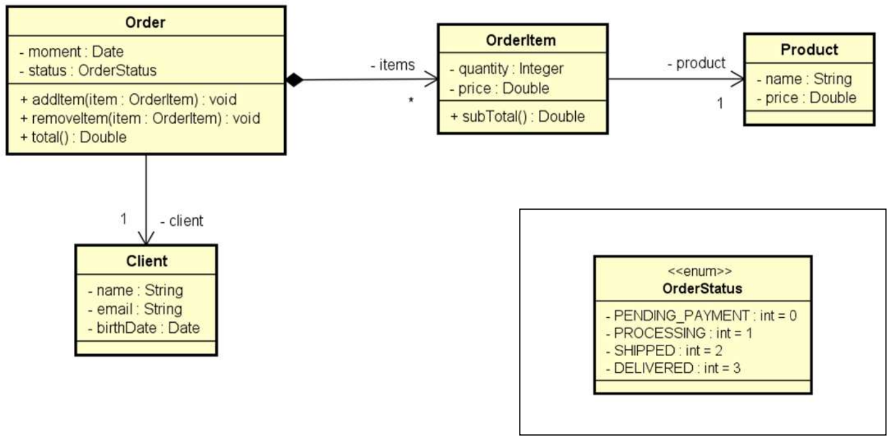

# Problema "Pedido"

Ler os dados de um pedido com N itens (N fornecido pelo usuário). Depois, mostrar um sumário do pedido conforme exemplo.
Nota: o instante do pedido deve ser o instante do sistema: new Date()

## Exemplo de entrada e saída

### Entrada

| Entrada                           | Exemplo 1      |
|:----------------------------------|:---------------|
| **Enter cliente data:**           |                |
| **Name:**                         | Alex Green     |
| **Email:**                        | alex@gmail.com |
| **Birth date (DD/MM/YYYY):**      | 15/03/1985     |
| **Enter order data:**             |                |
| **Status:**                       | PROCESSING     |
| **How many items to this order?** | 2              |
| **Enter #1 item data:**           |                |
| **Product name:**                 | TV             |
| **Product price:**                | 1000.00        |
| **Quantity:**                     | 1              |
| **Enter #2 item data:**           |                |
| **Product name:**                 | Mouse          |
| **Product price:**                | 40.00          |
| **Quantity:**                     | 2              |

### Saída

| Saída              | Exemplo 1                                     |
|:-------------------|:----------------------------------------------|
| **ORDER SUMMARY:** |                                               |
| **Order moment:**  | 20/04/2018 11:25:09                           |
| **Order status:**  | PROCESSING                                    |
| **Client:**        | Alex Green (15/03/1985) - alex@gmail.com      |
| **Order items:**   | TV, $1000.00, Quantity: 1, Subtotal: $1000.00 |
|                    | Mouse, $40.00, Quantity: 2, Subtotal: $80.00  |
| **Total price:**   | $1080.00                                      |

## Utilize a modelagem abaixo para desenvolver a solução



## 🛠️ Tecnologias e Ferramentas

- **Linguagem:** Java (JDK 17+)
- **IDE:** IntelliJ IDEA
- **Controle de Versão:** Git & GitHub
- **Documentação:** Markdown
- **Qualidade de Código:** SonarQube for IDE

<br>


---

## 🚀 Como Executar o Projeto

1. Clone este repositório no seu terminal:

```bash
git clone https://github.com/ivanfsilva/ds-pedido.git
```

2. Importe o projeto para a sua IDE de preferência (Eclipse, IntelliJ IDEA, VS Code, etc.).
3. Navegue até o pacote `application` e abra o arquivo `Program.java`.
4. Execute a classe `Program`.
5. Interaja com o sistema através do console da sua IDE, inserindo os dados conforme o exemplo de entrada (lembre-se de
   utilizar ponto como separador decimal para os valores numéricos).

---

## 👤 Autor

Desenvolvido por Ivan Ferreira.

Copyright © 2026 Ivan Ferreira. Todos os direitos reservados.

## ☕ Sobre

Projeto prático desenvolvido durante os treinamentos de Java da plataforma ⚡**DevSuperior**, ministrados pelo Prof. Dr.
Nélio Alves.